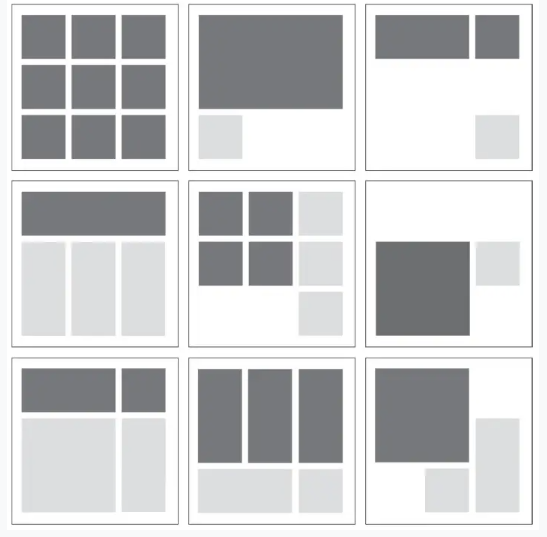

# CSS-Float-Flexbox-e-Grid
Funcionamento de CSS Float, Flexbox e Grid

# Atividade: Representação de Layouts com CSS Float, Flexbox e Grid

Esta atividade tem como objetivo compreender o funcionamento das propriedades de layout em CSS, aplicando-as na construção de três (3) diferentes layouts utilizando as estratégias de **Float**, **Flexbox** e **Grid**.

## Instruções para a Atividade

### 1. Estrutura dos Arquivos

1. Escolha **três layouts** baseados na imagem modelo fornecida.
2. Crie **três arquivos HTML**, um para cada layout, com as seguintes especificações:
   - O arquivo para o layout com **Float** deve ser nomeado como `float-layout.html`.
   - O arquivo para o layout com **Flexbox** deve ser nomeado como `flexbox-layout.html`.
   - O arquivo para o layout com **Grid** deve ser nomeado como `grid-layout.html`.

---

### 2. Estrutura e Estilo

1. **Estabeleça uma estrutura básica de HTML**:
   - Inclua uma tag `<style>` no `<head>` de cada arquivo para definir o CSS embutido.
   
2. **Especificações para o container principal**:
   - A largura e altura da `div` pai (`container`) devem ser de **500px**.
   - Adicione bordas ao container para visualização clara de sua área.

3. **Adicione estilos adicionais**:
   - Defina cores de fundo distintas para os elementos internos para destacar a estrutura.
   - Utilize espaçamento e margens conforme necessário para alinhar ao design visual fornecido.

---

### 3. Design e Fidelidade

- **Siga o design passado**:
  - Baseie-se fielmente no layout da imagem modelo fornecida.
  - Não altere a estrutura básica ou o alinhamento visual proposto.

